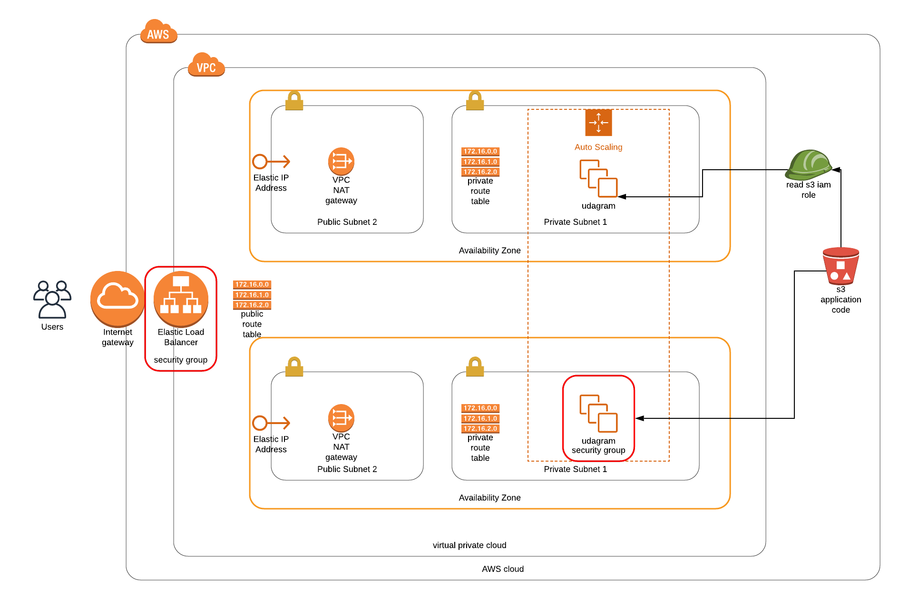

# Udacity Project 2: Deploy a highly available wep application using Cloudformation

Project 2 of the udacity nanodegree Cloud DevOps Engineering. In this project a high availability web application called udagram is deployed. An application user enters through load balancer .

## Architecture

The implemented Virtual Private Cloud contains two Availability Zones. Each availability zone contains a private and a public subnet. The EC2 instances on the private sub-nets reside in an auto-scaler group. The udagram application is retrieved from a S3 bucket. Apache webserver is installed on the EC2 instances in order to host the webapplication udagram. Finally elastic ip adresses are assigned to the public subnets.



## Files
There are four files called network.yml, servers.yml, servers-parameters.json, network-parameters.json. They comprise respectively the network stack and server+application stack.

## Instructions
The create.bat and update.bat files can be used to to run the two cloudformation scripts. For example:

```
create udagramnetworkstack network.yml network-parameters.json
create udagramserverstack servers.yml servers-parameters.json
```